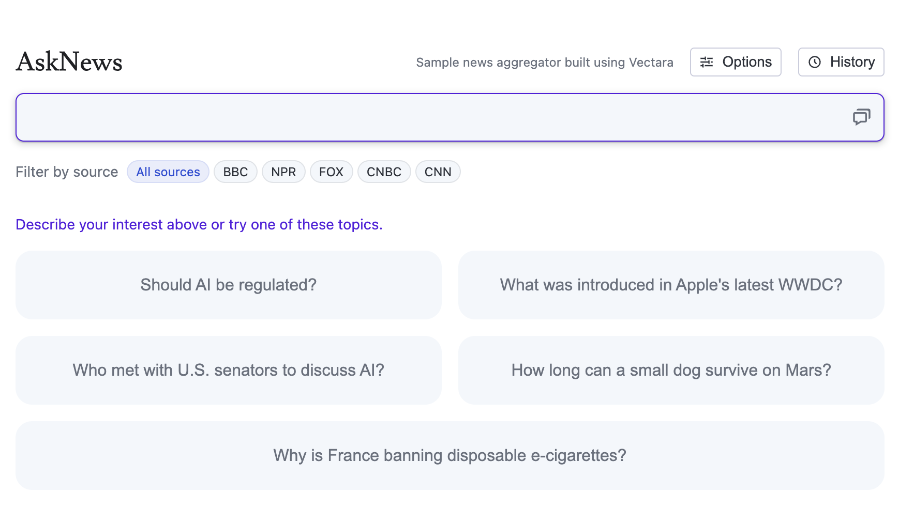
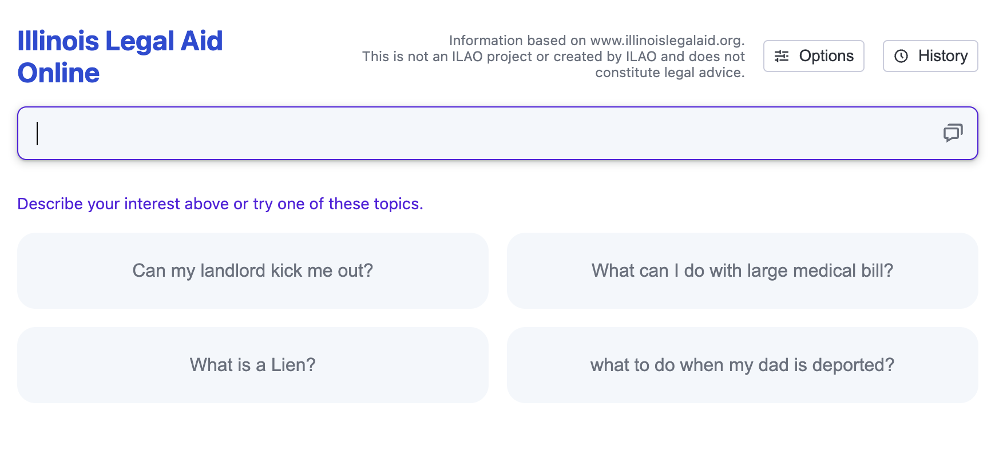
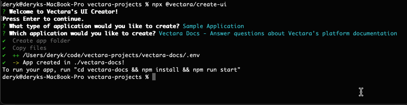

<p align="center">
  
</p>
<p>
  
  
  
  <a href="https://github.com/vectara/create-ui#readme" target="_blank">
    
  </a>
  <a href="https://github.com/vectara/create-ui/graphs/commit-activity" target="_blank">
    
  </a>
  <a href="https://twitter.com/vectara" target="_blank">
    
  </a>
</p>

## About

Create-UI is an tool for creating user interfaces, powered by the [Vectara Platform](https://vectara.com/).

For examples of what you'll be building, check out the following sites:

### [Ask News](https://asknews.demo.vectara.com)



### [LegalAid](https://legalaid.demo.vectara.com)



## Prerequisites

To get started, the minimum requirement is to install [npm and node](https://nodejs.org/en/download). That's it!

## Quickstart

Create-UI comes packaged with preset configurations that allow you spin up a sample application using Vectara's public datastores. To quickly get started, run the following command:

```
npx @vectara/create-ui
```

When prompted for which application to create, simply select from one of three default apps:

1. `Vectara Docs` - Answer questions about Vectara documentation
2. `Vectara.com` - Answer questions about the content of the Vectara company website
3. `AskFeynman` - Answer questions about Richard Feynman's lectures


After selecting which application to create, Create-UI will complete a short setup process. Once this process is complete, copy and run the provided commands to run the app in your browser at `http://localhost:4444`.



Congratulations! You've just setup and run a sample app powered by Vectara! We'll work on setting up a custom application later in the next section.

## Building Your Own Application

### Prerequisites

When building your own application, you will need to:

- **Create a data store:** Log into the [Vectara Console](https://console.vectara.com/) and [create a data store](https://docs.vectara.com/docs/console-ui/creating-a-corpus).
- **Add data to the data store.** You can use [Vectara Ingest](https://github.com/vectara/vectara-ingest/blob/main/README.md#quickstart) to crawl datasets and websites, or use our [Indexing APIs](https://docs.vectara.com/docs/api-reference/indexing-apis/indexing) directly.

### Running Your Custom App

If you choose `Custom Application` from the application type prompt, you will be asked to provide:

- your Vectara customer ID
- the ID of the corpus you created as a prerequisite to this process
- the API key of your selected Vectara corpus (**NOTE: Depending on your set up, this may be visible to users. To ensure safe sharing, ensure that this key is set up to only have query access.**)
- any sample questions to display on the site, to get your users started.


Once provided, the values above will go into your own customized `.env` configuration, and your site will be ready to go by running:

```
npm run start
```

## Make It Your Own!

Whether you choose to set up a preset application or build a custom app, you have the ability to make it your own.

### Modifying the UI

The UI source code is all in the `src/` sub-directory of your main project directory. You are free to make any changes to suit your unique needs.

NOTE: The UI assumes there is a metadata field called `url` for each document in your Vectara corpus. If the `url` field exists, it will be displayed with search results as a clickable URL. If it does not, the title is used instead, but it will not be clickable.

### Modifying the Proxy Server

While the app run via `npm run start` works with a local client that accesses the Vectara API directly, running the app via Docker spins up a full-stack solution, using a proxy server to make Vectara API requests.

In order to modify the request handlers, make changes to `/server/index.js`.

## Configuration

After the configuration process has created your `.env` file, you are free to make modifications to it to suit your development needs.

These variables can be set in your `.env` file, which is created during the quickstart process.

## Author

👤 **Vectara**

- Website: https://vectara.com
- Twitter: [@vectara](https://twitter.com/vectara)
- GitHub: [@vectara](https://github.com/vectara)
- LinkedIn: [@vectara](https://www.linkedin.com/company/vectara/)
- Discord: [@vectara](https://discord.gg/GFb8gMz6UH)

## 🤝 Contributing

Contributions, issues and feature requests are welcome!<br />Feel free to check [issues page](https://github.com/vectara/create-ui/issues). You can also take a look at the [contributing guide](https://github.com/vectara/create-ui/blob/master/CONTRIBUTING.md).

## Show your support

Give a ⭐️ if this project helped you!

## 📝 License

Copyright © 2023 [Vectara](https://github.com/vectara).<br />

_This repository contains sample code that can help you build UIs powered by Vectara, and is licensed under the Apache 2.0 License. Unless required by applicable law or agreed to in writing, software distributed under the License is distributed on an "AS IS" BASIS, WITHOUT WARRANTIES OR CONDITIONS OF ANY KIND, either express or implied. See the License for the specific language governing permissions and limitations under the License._
