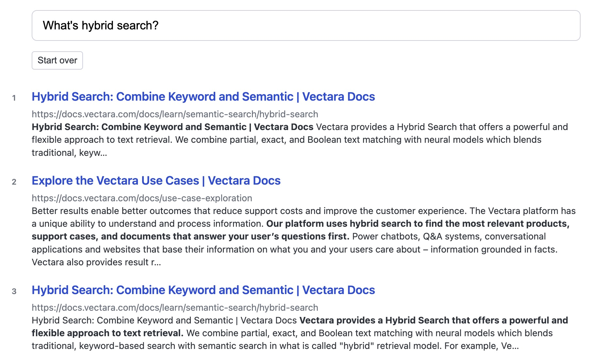
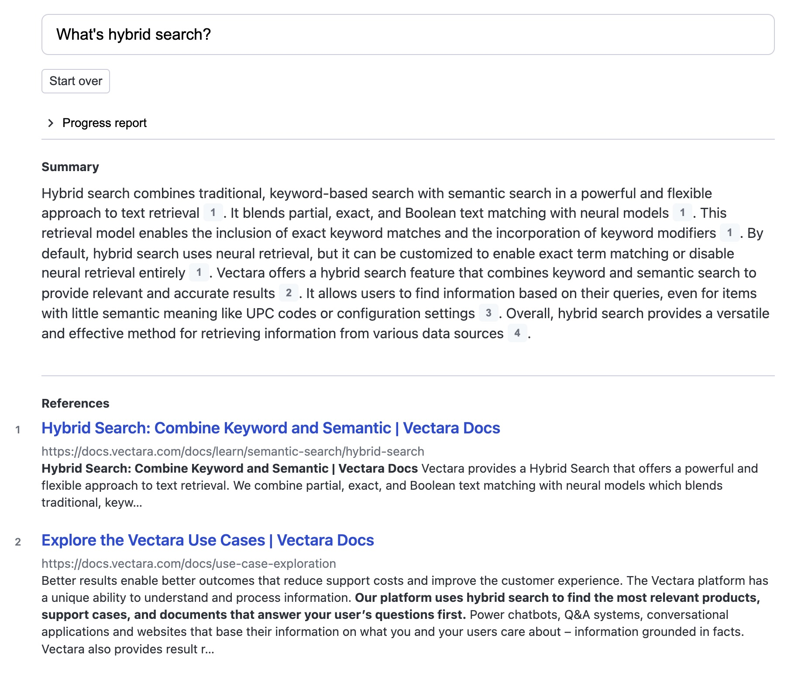
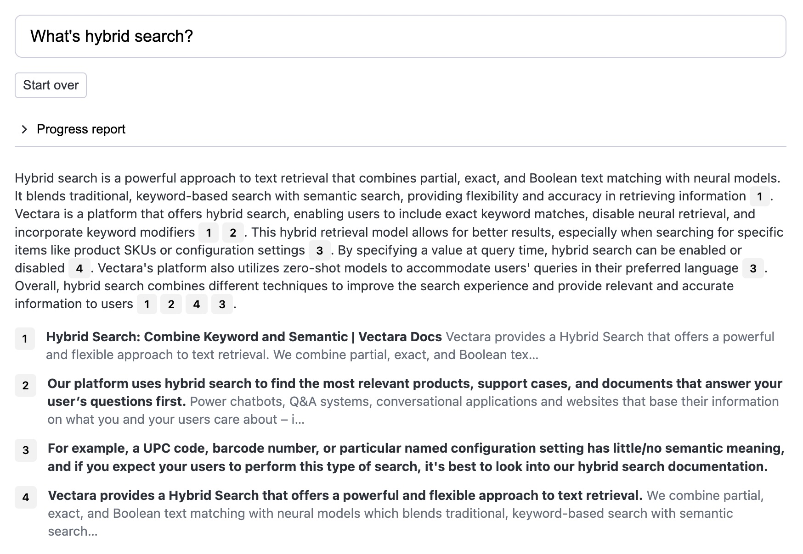
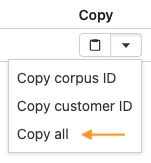

<p align="center">
  
</p>

# Create-UI

Create-UI is the fastest way to generate a [Vectara](https://vectara.com/)-powered sample codebase for a range of user interfaces:

- **Semantic search.** A typical search UI.
- **Summarized semantic search.** A typical search UI preceded by a summary of the most relevant results. Perfect for users who want to scan an overview before digging deeper into interesting search results.
- **Question and answer.** Ideal for users who want to ask an answer and get a concise answer.

Use this tool to:

- Run the UIs in your browser so you can compare them and choose the right one for your GenAI application.
- Borrow from our patterns for retrieving data from Vectara, restructuring the data, and surfacing it to users.
- Use the underlying code as a starting point or reference for building your UI.

> [!TIP]
>
> Looking for something else? Try another open-source project:
>
> - **[React-Search](https://github.com/vectara/react-search)**: Add Vectara semantic search to your React apps with a few lines of code.
> - **[Vectara Answer](https://github.com/vectara/vectara-answer)**: Configure a sample Docker app for searching Vectara data.
> - **[Vectara Ingest](https://github.com/vectara/vectara-ingest)**: Crawl data sources and ingest the data into Vectara.

## How to use

### 1. Install Node and NPM

Create-UI expects you to have [Node and NPM](https://nodejs.org/en/download) installed on your system.

### 2. Generate a codebase

```
npx @vectara/create-ui
```

Follow the prompts in the command line to generate a React codebase. You can choose to use our sample data, which is ideal for folks who don't have a Vectara account yet. If you already have data in Vectara you can configure the UI to connect to it. [Learn more below.](#set-up-your-data-in-vectara)

When the prompts are complete, run the build command provided to you. You'll see the UI running in your browser.

## Types of UIs

### Semantic Search UI



The Semantic Search UI is characterized by:

- A search box for entering a natural-language query. This can take the form of a question or just search terms.
- A list of search results.

A user will typically scan the list for relevant results and dig deeper into any results that look interesting. They'll try variations on the same basic query to make sure they find as many potentially useful results as possible.

### Summarized Semantic Search UI



The Summarized Semantic Search UI is characterized by:

- A search box for entering a natural-language query. This can take the form of a question or just search terms.
- A list of search results.
- A summary of search results that are most relevant to the query, with citations.

A user will typically scan the summary for points of interest, which is faster than reviewing the list of search results. If an aspect of the summary catches their eye, they'll dig deeper into the cited search result. They'll repeat this pattern until they've reviewed all of the interesting information that was relevant to their query.

### Question and Answer UI



The Question and Answer UI is characterized by:

- A search box for entering a natural-language query. This typically takes the form of a question.
- A condensed answer based upon the most relevant search results, with citations.

A user will typically scan the answer to see if it truly answers their question. They'll use the citations to verify that the answer is grounded in facts. If the answer doesn't fully answer their question they'll try again with a differently-worded question.

## Set up your data in Vectara

You can configure a Create-UI app to use our sample data or to pull data from your Vectara corpus. To set this up:

1. [Create a free Vectara account](https://console.vectara.com/signup).
2. [Create a corpus and add data to it](https://docs.vectara.com/docs/console-ui/creating-a-corpus).
3. [Create a **QueryService** API key](https://docs.vectara.com/docs/console-ui/manage-api-access#create-an-api-key).

**Pro-tip:** After you create an API key, navigate to your corpus and click on the "Access control" tab. Find your API key on the bottom and select the "Copy all" option to copy your customer ID, corpus ID, and API key. This gives you all the data you need to configure a Create-UI app.



### How to use metadata

Vectara enables you to define [metadata](https://docs.vectara.com/docs/learn/document-data-structuring#metadata) on your documents. Create-UI apps behave differently based on the presence of specific metadata fields:

- `title`: If this field is defined it will be rendered as the title of a search result. Typically this is something like the title of the document or webpage.
- `url`: If this field is defined, the UI will render the search result as a link to the defined URL.

## License

Create-UI is an open-sourced software licensed under the [Apache 2.0 license](/LICENSE).

_This repository contains sample code that can help you build UIs powered by Vectara, and is licensed under the Apache 2.0 License. Unless required by applicable law or agreed to in writing, software distributed under the License is distributed on an "AS IS" BASIS, WITHOUT WARRANTIES OR CONDITIONS OF ANY KIND, either express or implied. See the License for the specific language governing permissions and limitations under the License._
